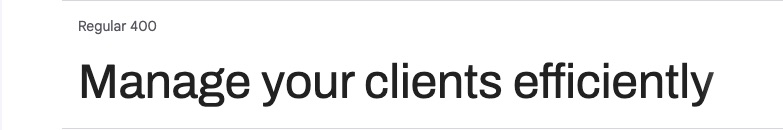
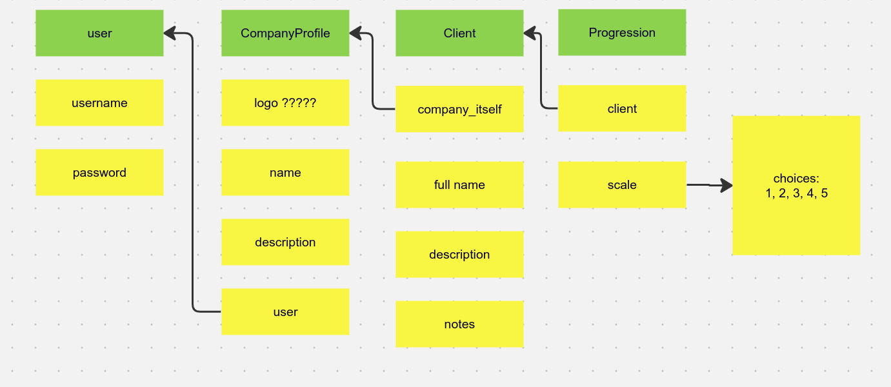

# Client - Management

Live Version: [Client-app](https://client-management-2b59dd79d4aa.herokuapp.com/)

Repository: [GitHub Repo](https://github.com/Omar-Alme/client-management-app)

The app is developed by [Omar Al-mehdhar](https://github.com/Omar-Alme)

*Insert app picture*

## About

[Client Management App]() is *Write about the app*

## User Experience 

### Target Audience

*Write about the target audience for the app*

### User Stories

#### **First time Visitor Goals**

| Issue ID    | User Story |
|-------------|-------------|
|[#1](https://github.com/Omar-Alme/client-management-app/issues/1)|As As a First Time Visitor I can understand the purpose of the website so that I can benefit from it|
|[#2](https://github.com/Omar-Alme/client-management-app/issues/2)|As a First time Visitor I can easily navigate around the website so that I can see the websites content|
|[#3](https://github.com/Omar-Alme/client-management-app/issues/3)|As a First time visitor and Business owner whose interested in the app I can register as a user so that I can access the benefits of the app.|

#### **Frequent Visior Goals**

| Issue ID    | User Story |
|-------------|-------------|
|[#4](https://github.com/Omar-Alme/client-management-app/issues/4)|As a Returning user and business owner I can log in to my account so that I can access the app.|
|[#5](https://github.com/Omar-Alme/client-management-app/issues/5)|As a Frequent user I can recover my account in case i forget my password so that I can access my account again.|
|[#6](https://github.com/Omar-Alme/client-management-app/issues/6)|As a Registered user I can see my account and navigate through the pages so that I can use the benefits of the app|
|[#7](https://github.com/Omar-Alme/client-management-app/issues/7)|As a Registered User I can Edit my account profile was logged in so that I can have my own unique personal profile holding my details|
|[#8](https://github.com/Omar-Alme/client-management-app/issues/8)|As a Registered User I can change the standard profile image and add my own so that I can have my own profile|
|[#9](https://github.com/Omar-Alme/client-management-app/issues/9)|As a Registered user I can update my profile whenever I can so that I can be up to date with my details|
|[#10](https://github.com/Omar-Alme/client-management-app/issues/10)|As a Registered User I can add a client so that I can keep track of the clients that work for me|
|[#11](https://github.com/Omar-Alme/client-management-app/issues/11)|As a Registered User I can Input client details so that Have an insight of the client Im working with.|
|[#12](https://github.com/Omar-Alme/client-management-app/issues/12)|As a Registered User I can Upload a profile picture of the client or their company when I input their details so that see who im working with clearly|
|[#13](https://github.com/Omar-Alme/client-management-app/issues/13)|As a Registered User I can View the added client on my summary in a card summary so that I can keep track of certain details of the client|
|[#14](https://github.com/Omar-Alme/client-management-app/issues/14)|As a Registered User I can Update/Edit my client card details so that i can stay up to date with my clients|
|[#15](https://github.com/Omar-Alme/client-management-app/issues/15)|As a Registered User I can View my updated client card in the dashboard so that Stay on track with my client and stay up to date|
|[#16](https://github.com/Omar-Alme/client-management-app/issues/16)|As a Registed User I can click on the summarised client card to view a more detailed card so that I can see more details of my client such as online presense and their business description|
|[#17](https://github.com/Omar-Alme/client-management-app/issues/17)|As a Registered User I can Delete the client so that I can remove clients that I no longer work with|
|[#18](https://github.com/Omar-Alme/client-management-app/issues/18)|As a Registered User I can see the new dashboard when i delete a client so that I can stay up to date with my present clients|
|[#19](https://github.com/Omar-Alme/client-management-app/issues/19)|As a Registered User I can add a limited amount of clients so that Stay focused as a business owner and keep track of them|
|[#20](https://github.com/Omar-Alme/client-management-app/issues/20)|As a Registered User I can view all my client cards on my dashboard so that I can see everyone clearlly with the important detail summaries|

## Technologies Used

- ### Languages:

    + [Python](https://www.python.org/): primary language used for the server-side of the website.
    + [JavaScript](https://www.javascript.com/): primary language for the interaction of the website.
    + [HTML](https://developer.mozilla.org/en-US/docs/Web/HTML): Markup language for the website.
    + [CSS](https://developer.mozilla.org/en-US/docs/Web/css): styling language used to style the website.

- ### Frameworks and libraries:

    + [Django](https://www.djangoproject.com/): python framework used to create all the logic.
    + [jQuery](https://jquery.com/): was used to control click events and sending AJAX requests.
    + [Bootstrap](https://getbootstrap.com/): most popular CSS framework for developing responsiveness

- ### Databases:

    + [SQLite](https://www.sqlite.org/): the development database.
    + [PostgreSQL](https://www.postgresql.org/): the database used to store all the data.  
  
- ### Other tools:

    + [Git](https://git-scm.com/): version control tool to manage the code
    + [Pip3](https://pypi.org/project/pip/): the package manager used to install dependecies
    + [Gunicorn](https://gunicorn.org/): webserver used to run the website
    + [Psycopg2](https://www.python.org/dev/peps/pep-0249/): used to connect the database
    + [Django-allauth](https://django-allauth.readthedocs.io/en/latest/): the authentication library used to create users and authenticate them
    + [Heroku](https://www.heroku.com/): cloud platform used to host the website
    + [ElephantSQL](https://www.elephantsql.com/): the cloud database used to store all the data 
    + [Github](https://github.com/): used to store the websites source code
    + [VScode](https://code.visualstudio.com/): the IDE used to develop the websiteß
    + [Chrome Devtools](https://developer.chrome.com/docs/devtools/open/): was used to debug the website
    + [Font Awesome](https://fontawesome.com/): platform used to create icons for the website
    + [W3C HTML Validator](https://validator.w3.org/): validator used to validate the HTML5 code for the website
    + [W3C CSS Validator](https://jigsaw.w3.org/css-validator/): validator used to validate the CSS code for the website
    + [JShint](https://jshint.com/): validator used to validate JS code for the website
    + [PEP8](https://pep8.org/): validator used to validate python code for the website
    + [Whitenoise](https://whitenoise.readthedocs.io/en/latest/): pip package to serve static files so they can deploy anywhere
   

## FEATURES

Please refer to the [FEATURES.md](FEATURES.md) file for all features of the application.

## Design 

TThe application's design adheres to the principles of Material Design, emphasizing simplicity in user interaction. The primary focus is on ease of use, achieved through the intentional design of components to be user-friendly. By adopting a minimalistic approach, the goal was to create a meaningful and purposeful design without unnecessary distractions. Given the multifunctional nature of the application and its numerous components, the strategic use of white spaces was employed to enhance the overall user experience, contributing to a more visually pleasing and intuitive interface.

### Colour Scheme

In this application, a thoughtfully curated color scheme has been implemented to enhance the user experience. The choice of shades of black for the navigation bar and footer creates a sleek and professional appearance, ensuring optimal readability and visual appeal in these areas.

The white background at the center of the page serves a dual purpose. Firstly, it provides a clean and uncluttered canvas, placing the main content in focus. Secondly, it contributes to a modern and minimalist aesthetic, promoting a sense of simplicity and ease of use for the end user.

Shades of purple have been carefully integrated into buttons and subtext, adding a touch of vibrancy and highlighting key interactive elements. This not only aids in drawing attention to important features but also introduces a visually engaging element to the overall design.

In essence, the chosen color scheme aims to strike a balance between professionalism, user-friendly aesthetics, and a touch of vibrancy for an enriched visual experience.

### Typography

The font used throughout the application is Archivo.

ARCHIVO was chosen for its modern and clean design, aligning with the application's focus on simplicity and user-friendly aesthetics. Its versatility and readability enhance the overall visual appeal, contributing to a cohesive and contemporary design language.

### Wireframes

 - 
 - .png)
 - 
 - 
 - 

 These were the wireframes aimed for. However alot of the designs and features were changed or altered. The look was similar but there are features that were not accomplished due to lack of time. These will be added in the future. 
 
 Check [FEATURES.md](FEATURES.md) for future features.

### Flowchart

This is a simple flowchart used. The flowcharts were created using [LucidChart](https://www.lucidchart.com/).

## Information Architecture

### Database
In the project's initial phases, the database was established utilizing SQLite for its simplicity and lightweight nature. Subsequently, as the project evolved and required a more robust database management system, it was migrated to PostgreSQL to accommodate increased scalability and performance demands.

### Entity-Relationship Diagram

