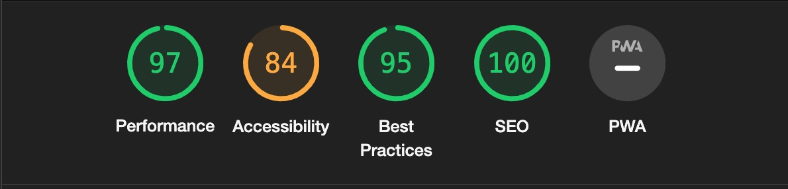
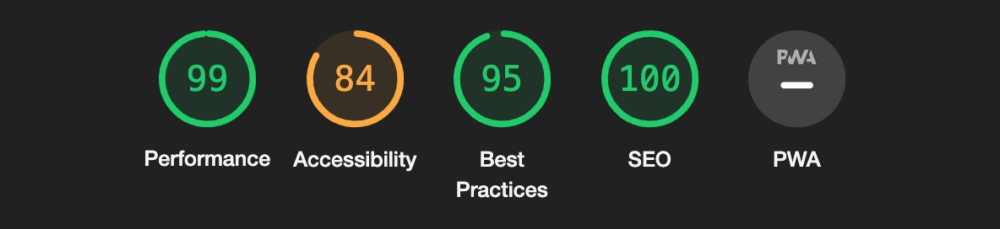
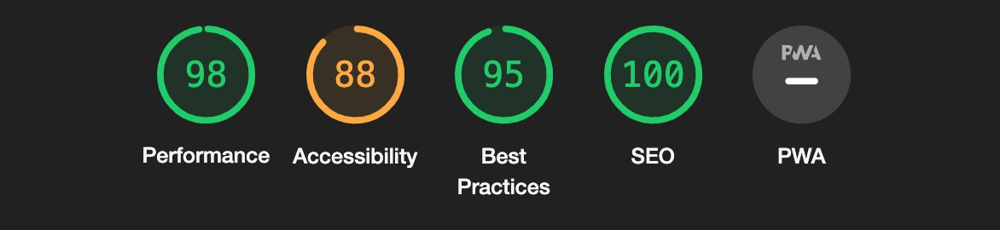
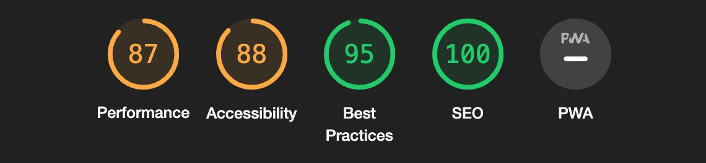
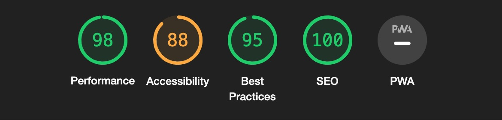
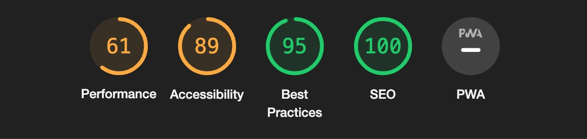
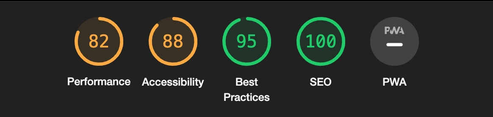
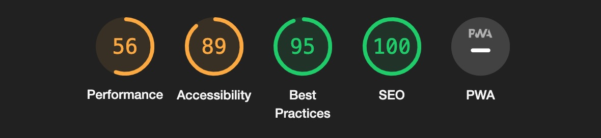
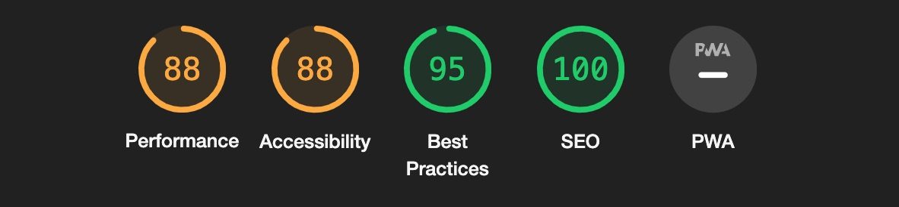

# Testing

## Manual Testing

Testing was done throughout site development, for each feature before it was merged into the master file.

Usability was tested with the below user acceptance testing, sent to new users to ensure testing from different users, on different devices and browsers to ensure issues were caught and where possible fixed during development.

|     | User Actions           | Expected Results | Y/N | Comments    |
|-------------|------------------------|------------------|------|-------------|
| Sign Up     |                        |                  |      |             |
| 1           | Click on the Get started button | Dropdown menu with 2 options: Login/SignUp | Y |          |
| 2           | Click on Get started button | Redirection to Sign Up page | Y |          |
| 3           | Click Get Started button in the hero section | Redirection to Sign Up page | Y |          |
| 4           | Click on the Login link in the form | Redirection to Login page | Y |          |
| 5           | Enter valid email | Field will only accept email address format | Y |          |
| 6           | Enter valid username | Field will only accept no more than 50 characters | Y |          |
| 10          | Enter valid password | Field will only accept secure passwords | Y |          |
| Dashboard          | Logged in displaying name | User sees personal dashboard | Y |          |
| Add Client          |  |  | |          |
| 1          | Add client button redirect to form | Redirected to form | Y |          |
| 2          | Submit form after filled | Add client to dashboard | Y |          |
| 3          | Edit client details | Update client card | Y |          |
| 4          | delete client button | redirect user to ask them if they are sure to delete client | Y |          |
| 5          | delete client | Remove client from users dashboard | Y |          |
| Profile page          |  |  | |          |
| 1          | Click profile avatar | Redirect user to profile page holding users data | Y|          |
| 2          | Click edit button on profile page | Redirect user to edit profile page |Y|          |
| 3          | Edit profile details | Updates users details on profile page when saved changes  | Y|          |

## Bugs

### Known bugs

There was a bug where clients would show across every user registered for the application

### Solved bugs

Solved this bug by creating a foreign key to match every user with their own unique clients and dashboard.

## Validation:
### HTML Validation:

- No errors or warnings were found when passing through the official [W3C](https://validator.w3.org/) validator. This checking was done manually by copying the view page source code (Ctrl+U) and pasting it into the validator.

### CSS Validation:

[CSS Validator](documentation/validation/cssvalid.jpeg)

- No errors or warnings were found when passing through the official [W3C (Jigsaw)](https://jigsaw.w3.org/css-validator/#validate_by_uri) validator except for the warnings about the use of css root variables and webkits for the box-shadow. However, css code works perfectly on various devices.

### JS Validation:

- No Vanilla javascript was used. Jquery and bootstrap made everything functional.

### Python Validation:

- No errors were found when the code was passed through Valentin Bryukhanov's [online validation tool](http://pep8online.com/). According to the reports, the code is [Pep 8-compliant](https://legacy.python.org/dev/peps/pep-0008/). This checking was done manually by copying python code and pasting it into the validator.

## Lighthouse Report

### Home Page

### Signup Page

### login Page

### dashboard Page

### profile Page

### edit profile Page

### client form Page

### client dashboard Page

### edit client Page

### delete client Page

## Compatibility

Testing was conducted on the following browsers;

- Brave;
- Chrome;
- Firefox;

# Responsiveness

The responsiveness was checked manually by using devtools (Chrome) throughout the whole development.

[Responsivness](documentation/design/responsiveness.pdf)